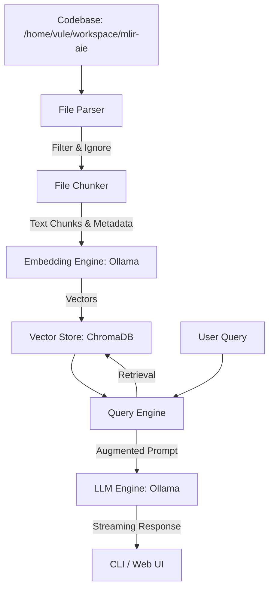

# Implementation Plan: Local LLM Codebase Indexer

This document details the plan to build a local codebase indexing and query assistant. The tool will scan a codebase (such as `/home/vule/workspace/mlir-aie`), parse and chunk files, generate embeddings using a local Ollama model (`nomic-embed-text`), store them in ChromaDB, and allow querying them using a local LLM (`qwen2.5-coder:14b`).

## 1. Core Architecture

The tool is structured as a Python-based utility that includes both a **CLI interface** and a **Web UI** for a premium user experience.



## 2. File Parsing & Chunking Strategies

Codebases contain diverse file formats and large build folders. We need an intelligent exclusion policy and clean chunking.

### 2.1 File Exclusion
We will automatically ignore:
- Hidden folders (e.g., `.git`, `.github`, `.vscode`, `.idea`)
- Package/Dependency directories (e.g., `node_modules`, `venv`, `ironenv`, `.venv`, `env`)
- Build directories (e.g., `build`, `dist`, `target`, `out`, `CMakeFiles`)
- Binary & metadata formats (e.g., `.png`, `.jpg`, `.zip`, `.pdf`, `.pyc`, `.log`, `.so`, `.a`, `.dylib`, `.o`)
- Lockfiles and large configs (e.g., `package-lock.json`, `pnpm-lock.yaml`, `cargo.lock`, `yarn.lock`, `compile_commands.json`)

Supported file types to index:
- Python (`.py`), C++ (`.cpp`, `.cc`, `.cxx`, `.h`, `.hpp`), MLIR (`.mlir`), TableGen (`.td`), CMake (`CMakeLists.txt`, `.cmake`), Shell Scripts (`.sh`), Markdown (`.md`), Rust (`.rs`), Go (`.go`), JavaScript/TypeScript (`.js`, `.ts`).

### 2.2 Chunker Configuration
Instead of naive character chunking, we will group source code lines:
- **Chunk Size**: Target ~1500–2500 characters (approx. 300-500 tokens).
- **Chunk Overlap**: ~200-400 characters (approx. 2-5 lines).
- **Line-Aware Splitting**: Chunks must start and end at line boundaries to avoid splitting mid-line.
- **Metadata**: Each chunk will store:
  - `file_path`: Absolute path and relative path.
  - `file_name`: File name.
  - `start_line`: Line number where chunk begins (1-indexed).
  - `end_line`: Line number where chunk ends.
  - `language`: Target language (inferred from extension).

## 3. Storage and LLM Integration

### 3.1 ChromaDB Integration
We will use ChromaDB to store vector embeddings. 
- Collections will be named based on the target folder (e.g., `mlir-aie`).
- The DB storage directory will reside in the workspace directory under `db/`.
- We will store the full chunk text, plus the metadata fields.

### 3.2 Ollama Client
A custom lightweight module to query Ollama:
- **Embeddings**: POST `/api/embeddings` with model `nomic-embed-text:latest`.
- **Generation**: POST `/api/chat` (supporting streaming) with model `qwen2.5-coder:14b`.
- Automatic handling of API errors and retries.

## 4. UI / UX Design

### 4.1 CLI Interface
Using the `rich` library, we'll build a CLI:
- `python -m llm_indexer.cli index <path>`: Show status bar, file scan counts, progress bar for embedding generation, and summary statistics (e.g., files parsed, chunks created, time elapsed).
- `python -m llm_indexer.cli query "<question>"`: Retrieve context and print streamed Markdown response.
- `python -m llm_indexer.cli chat`: An interactive, stylized terminal chat loop with the codebase.

### 4.2 Web User Interface
A FastAPI-based web service serving a beautiful SPA (Single Page Application):
- **Dashboard**: Shows index status, total files, total chunks, active database name.
- **Index View**: Form to index new directories. Shows a logs section streaming the parsing process.
- **Chat Interface**: Sleek dark-mode interface with code styling, message history, reference links showing exact line ranges in retrieved files, and smooth streaming.

## 5. Directory Layout

The codebase will be organized inside `/home/vule/workspace/llm-indexer` as follows:

```
llm-indexer/
│
├── llm_indexer/
│   ├── __init__.py
│   ├── config.py          # Port, Host, Model parameters
│   ├── ollama_client.py   # Ollama API helper
│   ├── parser.py          # Scans files, ignores build directories
│   ├── chunker.py         # Smart code chunker
│   ├── store.py           # ChromaDB client & vector CRUD operations
│   ├── cli.py             # Rich CLI tool
│   ├── app.py             # FastAPI App
│   └── static/            # Static assets for Web UI
│       ├── index.html     # SPA layout
│       ├── style.css      # Premium dark-theme styling
│       └── app.js         # Frontend controller and websockets/SSE logic
│
└── requirements.txt       # Dependencies
```
